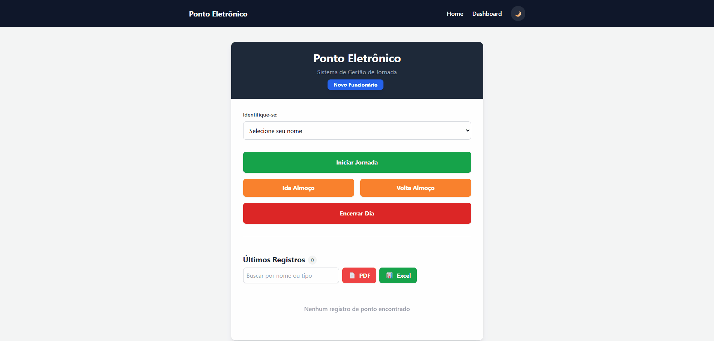
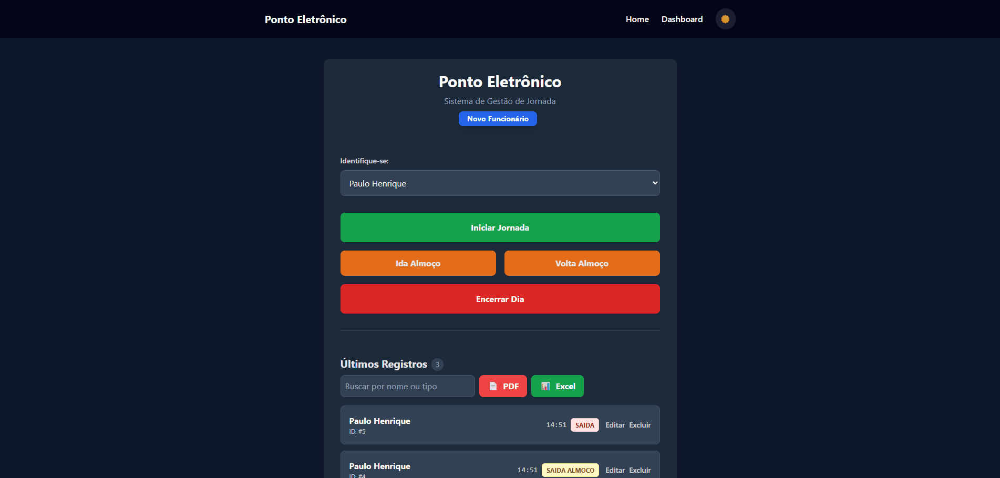

# Sistema de Ponto Eletrônico (Fullstack)


> Um sistema completo para gestão de jornada de trabalho, rodando 100% containerizado.

## Demonstração




### Funcionalidades

- Registro de ponto eletrônico (Entrada, Saída Almoço, Volta Almoço, Saída)
- Cadastro de funcionários
- Listagem de registros de ponto em tempo real
- **Exportação de relatórios em PDF e Excel**
- Dashboard gerencial com gráficos e estatísticas
- Edição e exclusão de registros de ponto
- Sistema de busca e filtros
- Paginação automática
- Interface responsiva e moderna com Tailwind CSS
- Notificações toast para feedback de ações
- Validação de formulários
- Sistema totalmente containerizado com Docker

### Tecnologias Utilizadas

Este projeto foi desenvolvido com foco em arquitetura moderna e escalável:

- **Frontend:** React + Vite + TypeScript
- **Estilização:** Tailwind CSS
- **Backend:** Node.js + Express + TypeScript
- **Banco de Dados:** PostgreSQL
- **ORM:** Prisma
- **Infraestrutura:** Docker & Docker Compose

### Como rodar o projeto

Você só precisa ter o **Docker** instalado. Não é necessário instalar Node ou Banco de Dados na sua máquina.

1. Clone o repositório:

```bash
git clone https://github.com/PauloHenriqueJunio/sistema-ponto.git
cd sistema-ponto
```

2. Suba os containers:

```bash
docker compose up -d
```

> **As migrations do banco são aplicadas automaticamente na inicialização!**

3. Acesse a aplicação:
   - **Frontend:** http://localhost:5173
   - **Backend:** http://localhost:3000
   - **Banco de Dados:** localhost:5432

### Comandos Úteis

**Parar os containers:**

```bash
docker compose down
```

**Ver logs:**

```bash
docker compose logs -f
```

**Reiniciar um serviço específico:**

```bash
docker compose restart frontend
docker compose restart backend
```

**Acessar o banco de dados:**

```bash
docker compose exec db psql -U admin -d pontodb
```

**Criar nova migration (apenas se necessário):**

```bash
docker compose exec backend npx prisma migrate dev --name nome_da_migration
```

### API - Rotas Disponíveis

#### Usuários

**GET** `/users`

- Lista todos os usuários cadastrados
- Resposta: `200 OK`

```json
[
  {
    "id": 1,
    "name": "João Silva",
    "email": "joao@email.com",
    "role": "FUNCIONARIO",
    "createdAt": "2025-12-27T10:00:00.000Z"
  }
]
```

**POST** `/users`

- Cria um novo usuário
- Body:

```json
{
  "name": "João Silva",
  "email": "joao@email.com",
  "password": "123456",
  "role": "FUNCIONARIO"
}
```

- Resposta: `201 Created`

#### Pontos

**GET** `/pontos`

- Lista todos os registros de ponto
- Resposta: `200 OK`

```json
[
  {
    "id": 1,
    "userId": 1,
    "type": "ENTRADA",
    "timestamp": "2025-12-27T08:00:00.000Z",
    "user": {
      "name": "João Silva"
    }
  }
]
```

**POST** `/pontos`

- Registra um novo ponto
- Body:

```json
{
  "userId": 1,
  "type": "ENTRADA"
}
```

- Tipos válidos: `ENTRADA`, `SAIDA_ALMOCO`, `VOLTA_ALMOCO`, `SAIDA`
- Resposta: `201 Created`

### Estrutura do Projeto

```
sistema-ponto/
├── backend/
│   ├── src/
│   │   └── server.ts
│   ├── prisma/
│   │   └── schema.prisma
│   ├── Dockerfile
│   └── package.json
├── frontend/
│   ├── src/
│   │   ├── App.tsx
│   │   └── main.tsx
│   ├── Dockerfile
│   └── package.json
└── docker-compose.yml
```

### Desenvolvimento Local

Para desenvolvimento sem Docker:

**Backend:**

```bash
cd backend
npm install
npx prisma migrate dev
npm run dev
```

**Frontend:**

```bash
cd frontend
npm install
npm run dev
```

### Contribuindo

1. Fork o projeto
2. Crie uma branch para sua feature (`git checkout -b feature/MinhaFeature`)
3. Commit suas mudanças (`git commit -m 'feat: Adiciona MinhaFeature'`)
4. Push para a branch (`git push origin feature/MinhaFeature`)
5. Abra um Pull Request

### Licença

Este projeto está sob a licença MIT.

### Autor

Feito por **Paulo Henrique**

##

[](https://www.linkedin.com/in/paulo-henrique-junio/)
[](mailto:paulohenriquejunio@hotmail.com)
